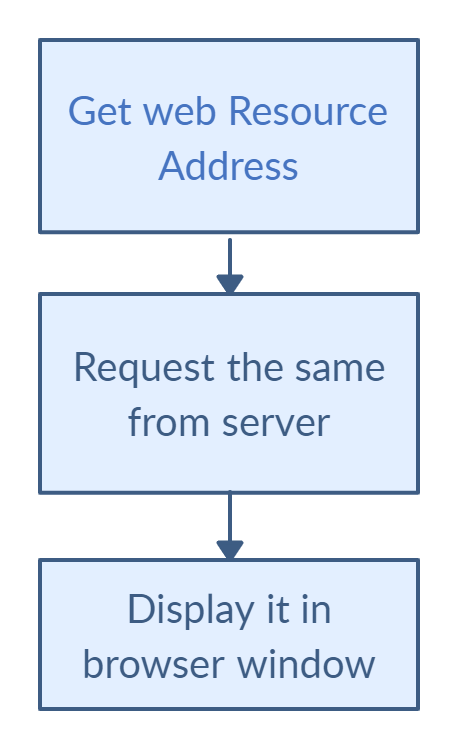
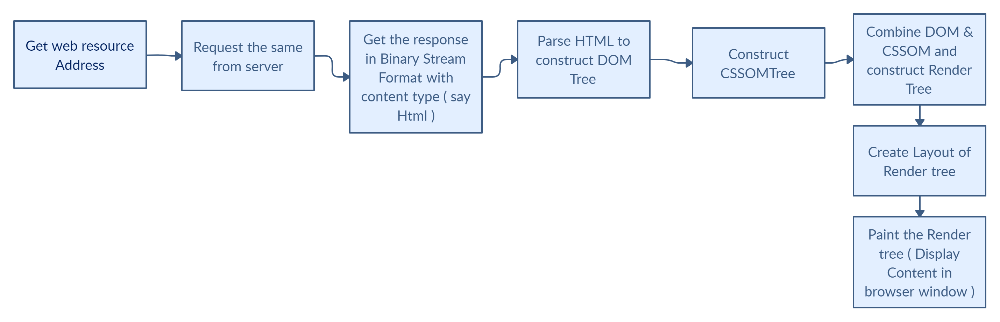
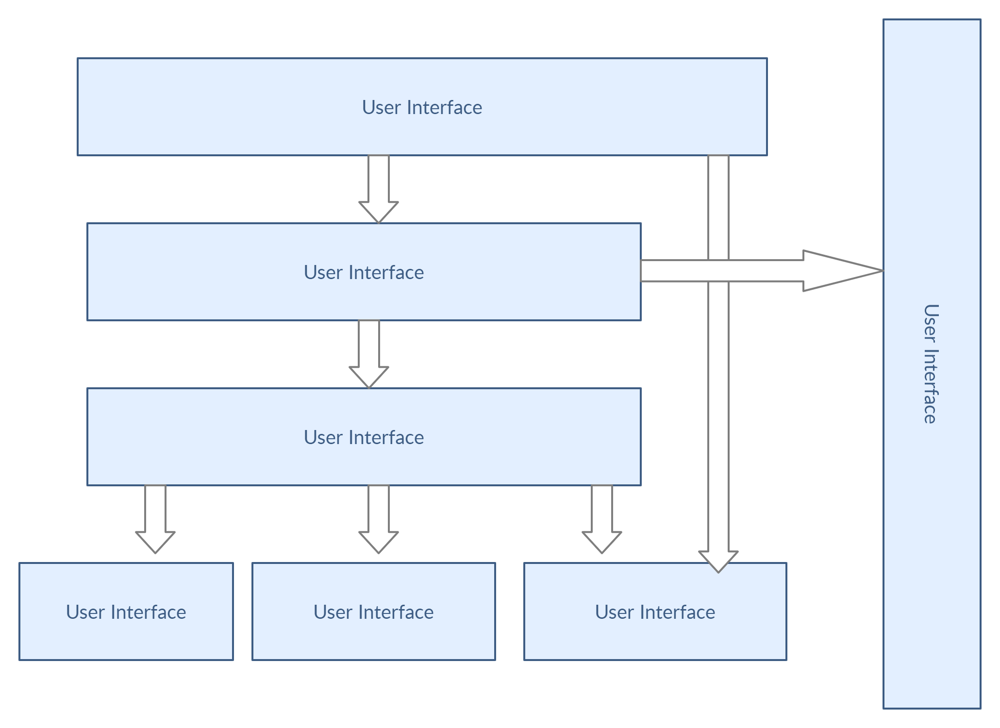

Assignment 1
============

Main Functionality of Browser
-----------------------------

The main functionality of the browser is to fetch and present the resource we choose, It asks for the resource from the server and display it in the browser window. The below flowcharts depict the high and low level working flows of the browser.

### High Level Browser Flow

### Low Level Browser Flow

High Level Componet of the browser
----------------------------------

The browser main components are as follow :

*   **The user interface :** this includes the address bar, back/forward button, bookmarking menu, etc. Every part of the browser display except the window where you see the requested page.
*   **The browser or rendering engine :** responsible for displaying requested content. For example if the requested content is HTML, the rendering engine parses HTML and CSS, and displays the parsed content on the screen.
*   **Networking component :** for network calls such as HTTP requests. It also implements cache of retrieved documents to minimize network traffic.
*   **UI backend component :** this helps to draw widgets like a select box, an input box, a check box, etc..
*   **JavaScript interpreter :** Used to parse and execute JavaScript code.
*   **Data storage component :** This layer is persistent which helps the browser to store data (like Cookies, Local Storage, Session Storage, IndexedDB, WebSQL, and FileSystem) locally.

### Browser Components

Rendering engine and its use.
-----------------------------

Rendering engine is the component of the browser, which is responsible to render the requested content in the browser. Different browsers use different rendering engine. HTML, CSS, or JavaScript, these languages are standardized by some entity or some organization. However, how a browser manages them together to render things on the screen is not standardized. The browser engine of Google Chrome might do things differently than the browser engine of Safari. That is why the engine for different browser may differ.

Use of Rendering engine.

*   Parsing HTML to construct the DOM tree
*   Render tree construction
*   Layout of the render tree
*   Painting the render tree

Parsers
-------

Firts off, lets see what is parsing. Parsing a document means translating it to a structure the code can use. The result of parsing is usually a tree of nodes that represent the structure of the document. This is called a parse tree or a syntax tree.

There are different parser are used in rendering engine.

*   **HTML Parser :**The job of the HTML parser is to parse the HTML markup into a parse tree.
*   **CSS Parser :**unlike HTML, CSS is a context free grammar and can be parsed using the types of parsers.

Script Processing
-----------------

When the browser processes an HTML document, it does so from top to bottom. Upon encountering a script tag, it halts/blocks further processing in order to download the referenced script file. Only after that download has completed and the respective JavaScript code has been processed, HTML processing continues. To prevent this render blocking, we can make the script either async or defer. In async we won't guarantee the sequence as the name suggest async, but in defer, it follow the sequence.